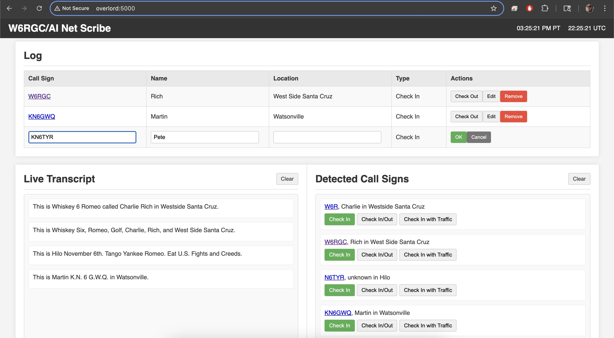

# W6RGC/AI Net Scribe

W6RGC/AI Net Scribe a tool designed to assist with logging and managing amateur radio net check-ins. It uses AI to transcribe live audio and detect call signs, simplifying the Net Control Station's job.

The app has three concurrent views: live transcription, operator spotting, and a check in list. 

Allows for one click check-ins, check management, and check in edits. Links to QRZ.com too.

## Features

*   **Live Transcription:** Automatically transcribes audio from the net.
*   **Call Sign Detection:** Identifies call signs mentioned in the transcript.
*   **Log Management:** Allows for manual entry, editing, and removal of check-ins.
*   **Real-time Updates:** The log and detected call signs are updated in real-time.

## Screenshot


*Caption: The main interface of W6RGC/AI Net Scribe showing the log, live transcript, and detected call signs.*

## Getting Started

These instructions will get you a copy of the project up and running on your local machine for development and testing purposes.

### Prerequisites

*   Python 3.x
*   Access to a microphone recognized by your system.
*   A Google Gemini API Key.

### Installation

1.  **Clone the repository:**
    ```bash
    git clone <your-repository-url>
    cd W6RGC_AI_Net_Scribe 
    ```
2.  **Create and activate a virtual environment (recommended):**
    ```bash
    python -m venv .venv
    source .venv/bin/activate  # On Windows use `.venv\Scripts\activate`
    ```
3.  **Install the dependencies:**
    ```bash
    pip install -r requirements.txt
    ```
4.  **Set up your Google Gemini API Key:**
    *   Create a file named `gemini_api_key.txt` in the root of the project.
    *   Paste your Gemini API key into this file and save it.
5.  **Configure your audio device:**
    *   Open the `constants.py` file.
    *   Modify the `DEVICE_NAME` variable to match the name of your microphone as recognized by your system. You might need to run a simple `sounddevice` script to list available devices if you are unsure (e.g., `python -m sounddevice`).

### Running the Application

Once the installation is complete, you can run the application using:

```bash
python main.py
```

This will start the audio processing backend and the Flask web server. You can access the web interface by navigating to `http://localhost:5000` in your web browser.

## Contributing

(TODO: Add guidelines for contributing to the project)

## License

This project is licensed under the Apache License 2.0. See the `LICENSE` file for details.

A copy of the Apache License 2.0 is also included at the top of each Python source file. 